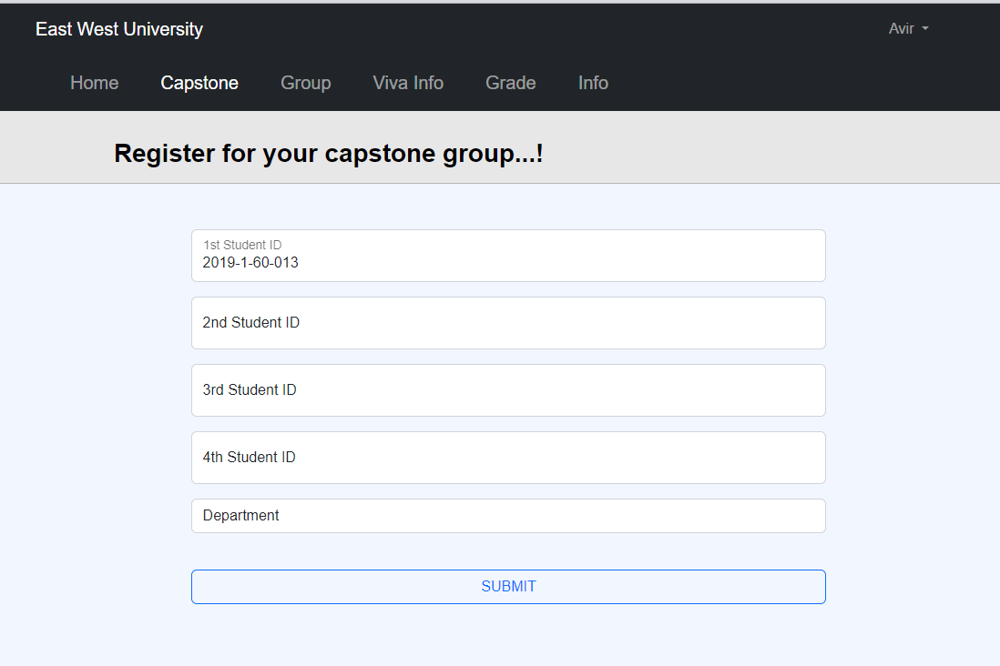
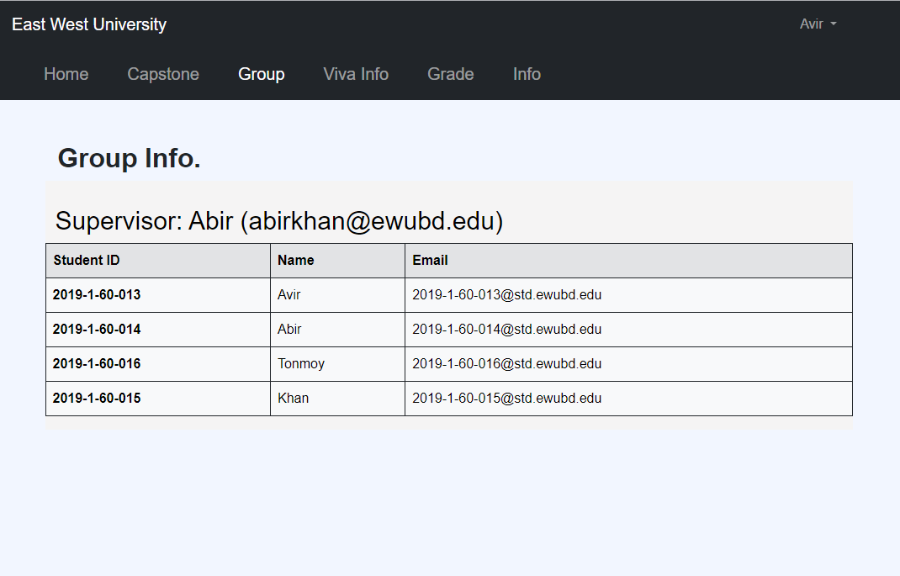
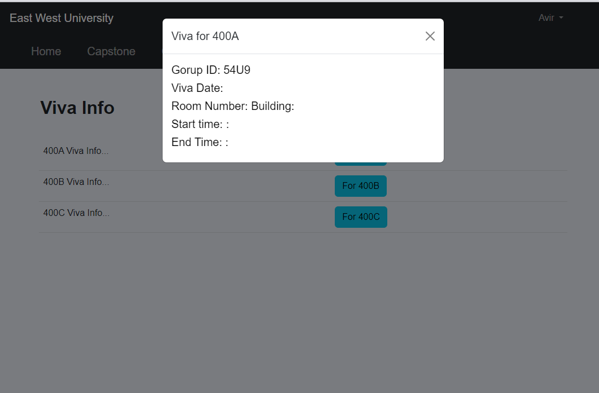
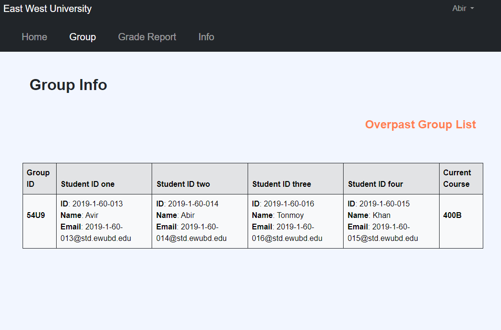
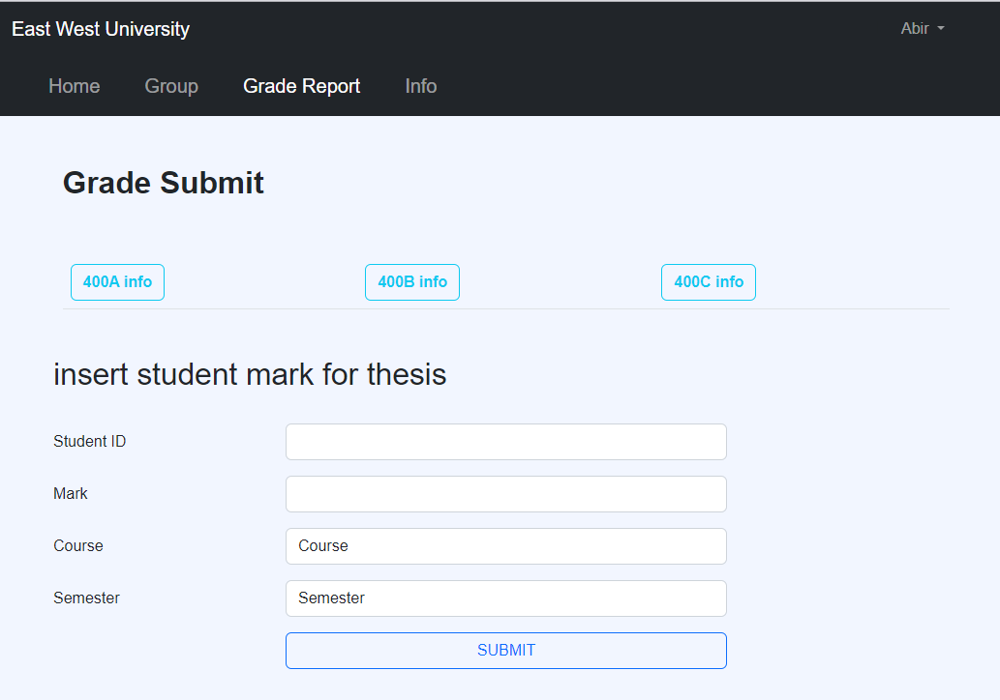
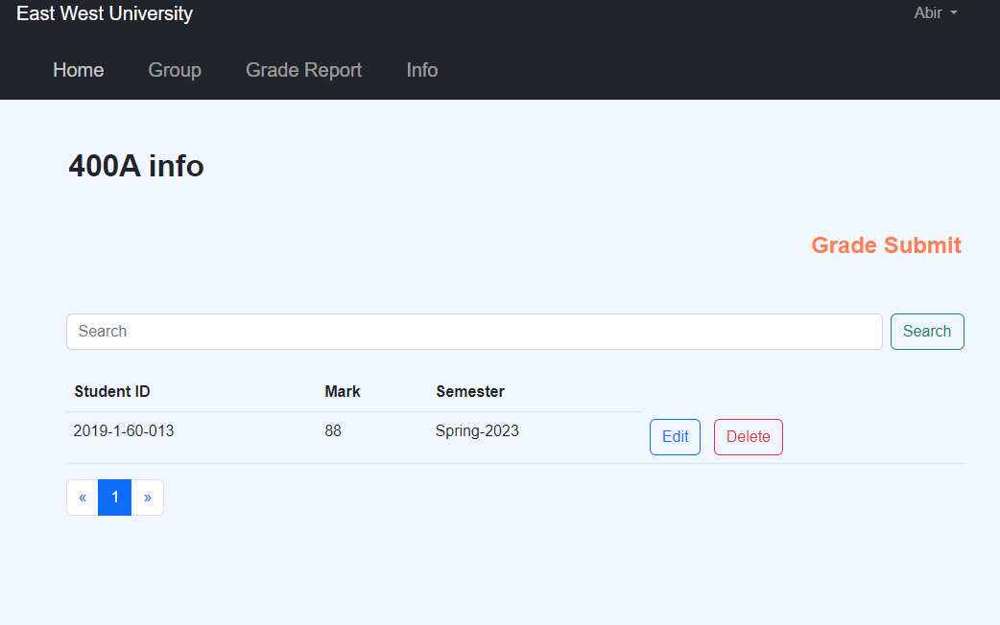

# Capstone Management System

## Project Overview
The **Capstone Management System** is designed to facilitate the management of capstone projects for students, faculty, and administrators at East West University. It enables students to register for capstone projects, form groups, and receive guidance from supervisors. Faculty members can monitor and grade students' progress, while administrators have full control over group creation, project allocation, and grading processes.

## Features
- **User Roles**:
  - **Admin**: Can manage the system, including accepting/rejecting capstone applications, assigning supervisors, and editing student information.
  - **Students**: Can register for capstone projects in groups and track project progress.
  - **Faculties**: Can evaluate students, monitor group progress, and assign final grades.
  - **Supervisor**: Can monitor project groups and grade their final output. Supervisors can be assigned to multiple groups.

- **Capstone Registration**:
  - **Validation & Verification**: Only students from East West University can register for capstone projects. Student credentials are verified upon registration.
  - **Group Registration**: Students can register either individually or as a group. After registration, the admin assigns a supervisor to the group.

- **Supervisor Management**: Admins assign supervisors, and each supervisor can oversee multiple project groups. Supervisors are responsible for grading each phase of the capstone.

- **Capstone Phases**: 
  - The capstone project is divided into three phases: **Phase A**, **Phase B**, and **Phase C**.
  - Each phase includes a **viva** session, which is evaluated by the viva board.
  - Supervisors can add viva scores for each phase, and students can view their scores along with viva board details such as the boardroom and viva schedule.

- **Group Information**: Displays group member details, project title, and assigned supervisor information.

- **Faculty Information**: Contains a list of faculty members involved in the capstone program.

- **Board Information**: Details viva board numbers, board members, room allocations, and time slots for viva presentations.

## System Components
- **Login System**: Users (admin, students, faculty) can log in using their university credentials.

- **Capstone Project Management**:
  - **Project Registration**: Students apply for projects, and admins assign supervisors.
  - **Group Information**: Manage details like group members and project title.
  - **Faculty Management**: Manage faculty participation in capstone projects.
  - **Grading**: Faculties and supervisors can assign and update student grades for each viva phase (A, B, C).

- **Viva Management**:
  - Students can see their viva scores, board information (boardroom, members), and schedule after each viva phase.

## Pages
- **Registration Page**: For students to apply for capstone projects.
- **Viva Schedule Page**: Shows viva presentation schedules, including board information and time slots.

## Requirements
- **Login**: Students, admin, and faculty can log in with their university credentials.
- **Capstone Registration**: Admin can accept or reject student applications based on predefined requirements.
- **Supervisor Assignment**: Admin assigns a supervisor to each group, and a supervisor can oversee multiple groups.
- **Capstone Phases & Viva**: The project is divided into three phases (A, B, C), with each phase having a viva that is graded by the supervisor. Students can view their viva results, room information, and schedule.

## Technologies Used
- **Backend**: Built using raw **PHP**.
- **Frontend**: Styled with **Bootstrap** for a clean and simple design.
- **Database**: Uses **MySQL** for storing and managing data.
- **Email Verification**: **PHPMailer** is used for sending verification emails to students' university email addresses.

> **Note**: The website is simple and clean in design, but the backend is very dynamic and well-structured. This website was built as a project during my time learning web programming at university.

## Screenshots
### Student View:
- 
- 
- 

### Faculty View:
- 
- 
- 

## Conclusion
The Capstone Management System provides a streamlined process for managing capstone projects, supporting both students and faculty. It simplifies project registration, group formation, grading, and viva scheduling, making the entire process more efficient and easier to manage.

